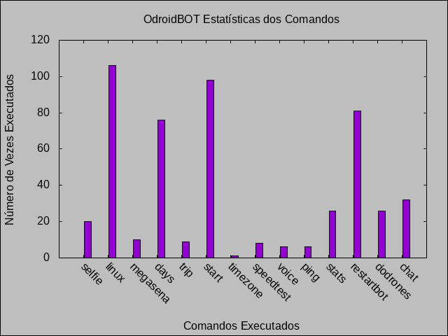
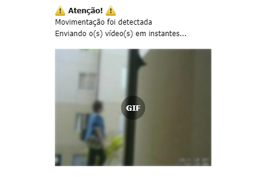

# Telegram Bot Odroid-Contas [@odroidbrBot](https://web.telegram.org/#/im?p=%40odroidbrBot)

Sou um bot para o telegram desenvolvido com o apoio da API escrita em shellscript [ShellBot](https://github.com/shellscriptx/shellbot/wiki)

## Descrição

Eu levo esse nome (odroid-contas) pois:

- **odroid** - Estou hospedado e funcionando 24 horas por dia nessa placa [odroid-c2](https://www.hardkernel.com/shop/odroid-c2/)
- **contas** - Inicialmente fui criado para gerenciar minhas contas pessoais e depois o projeto foi crescendo

Como já falado, a API de apoio é escrita em shellscript e eu também sou inteiramente escrito em shellscript. Faço parte de um projeto pessoal para fins de aperfeiçoamento nos estudos dessa linguagem e acabou no que temos aqui. Abaixo mostro todos os comandos que atualmente possuo.

## 'Bot' Commands

Veja abaixo a lista e descrição dos comandos.  
Para me conhecer melhor é só me chamar no telegram [@odroidbrBot](https://web.telegram.org/#/im?p=%40odroidbrBot)

| Comando | Descrição |
| --- | --- |
| start | Informações iniciais |
| selfie | Envia uma foto atual tirada da minha webcam |
| megasena | Mostra último resultado |
| ping | Pong |
| stats | Mostra estatísticas dos comandos mais usados |
| voice | Transforma o seu texto em mensagem de áudio |
| speedtest | Envia verificação da velocidade da minha internet |
| linux | Para testar comandos básicos em shell (requer admin) |
| days | Retorna o número de dias restantes para a data especificada |
| chat | Liga ou desliga modo falante do bot |
| dodrones | Faz backup de arquivos para um HD externo conectado em mim (requer admin) |
| restartbot | Reinicia e atualiza o meu repositório de código local |
| timezone | Mostra o horário da localização especificada |
| motion | Liga ou desliga monitoramento residencial através da minha webcam (requer admin) |

## Exemplos

**Comando** `stats`

Aqui é um exemplo do retorno do comando stats, que envia um gráfico com os comandos executados

**Comando** `motion`

Esse comando envolve monitoramente residencial. Quando meus donos estão fora de casa eu posso enviar movimentos suspeitos!!!

## Contribuição

Sinta-se a vontade para contribuir
